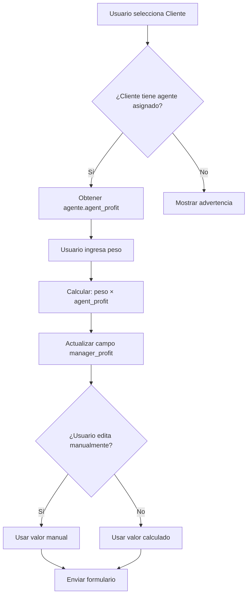

# Cálculo Automático de Ganancia del Manager en Deliveries

**Fecha:** 10 de noviembre de 2025  
**Componentes Modificados:**
- `apps/admin/src/components/delivery/CreateDeliveryDialog.tsx`
- `apps/admin/src/components/delivery/EditDeliveryDialog.tsx`

---

## 📋 Resumen de Cambios

Se implementó el cálculo automático de la **ganancia del manager** en los formularios de creación y edición de deliveries. El cálculo se basa en el `agent_profit` del agente asignado al cliente y el peso del delivery.

### Fórmula de Cálculo

```
Ganancia del Manager = Peso del Delivery (lb) × Agent Profit ($/lb)
```

---

## 🎯 Características Implementadas

### 1. **Cálculo Automático Inteligente**

- ✅ Se obtiene el **agente asignado** al cliente seleccionado
- ✅ Se toma el **`agent_profit`** del agente (no del cliente)
- ✅ El cálculo se actualiza automáticamente cuando cambia:
  - El cliente seleccionado
  - El peso del delivery
- ✅ El campo es **editable** manualmente si se necesita ajustar

### 2. **Validación y Retroalimentación**

#### Cuando hay agente asignado:
```
Cálculo: 5.5 lb × $2.50/lb (profit del agente Juan Pérez) = $13.75
```

#### Cuando NO hay agente asignado:
```
⚠️ Este cliente no tiene un agente asignado
```

---

## 🔧 Cambios Técnicos Detallados

### CreateDeliveryDialog.tsx

#### 1. **Hooks Adicionales**

```typescript
// Obtener lista de agentes
const { data: agentsData } = useUsers({ role: 'agent' });
const agents = useMemo(() => agentsData?.results || [], [agentsData?.results]);
```

#### 2. **Obtención del Agente Asignado**

```typescript
// Obtener el cliente seleccionado
const selectedClient = useMemo(() => {
  if (!formData.client_id) return null;
  return clients.find(c => c.id.toString() === formData.client_id);
}, [formData.client_id, clients]);

// Obtener el agente asignado al cliente seleccionado
const assignedAgent = useMemo(() => {
  if (!selectedClient || !selectedClient.assigned_agent) return null;
  return agents.find(a => a.id === selectedClient.assigned_agent);
}, [selectedClient, agents]);
```

#### 3. **Efecto para Cálculo Automático**

```typescript
// Efecto para calcular automáticamente la ganancia del manager
useEffect(() => {
  if (assignedAgent && formData.weight) {
    const weight = parseFloat(formData.weight);
    const agentProfit = assignedAgent.agent_profit || 0;
    
    if (!isNaN(weight) && weight > 0 && agentProfit > 0) {
      const calculatedProfit = weight * agentProfit;
      setFormData(prev => ({ 
        ...prev, 
        manager_profit: calculatedProfit.toFixed(2) 
      }));
    }
  } else if (!assignedAgent || !formData.weight) {
    // Limpiar la ganancia si no hay agente asignado o peso
    setFormData(prev => ({ ...prev, manager_profit: '' }));
  }
}, [assignedAgent, formData.weight]);
```

#### 4. **UI con Retroalimentación**

```typescript
{/* Ganancia del Manager */}
<div className="grid gap-2">
  <Label htmlFor="manager_profit">
    Ganancia del Manager (Editable)
  </Label>
  <Input
    id="manager_profit"
    type="number"
    step="0.01"
    placeholder="Calculado automáticamente"
    value={formData.manager_profit}
    onChange={(e) =>
      setFormData((prev) => ({ ...prev, manager_profit: e.target.value }))
    }
    className="border-gray-200 focus:border-orange-300 focus:ring-orange-200"
  />
  {assignedAgent && formData.weight && (
    <p className="text-xs text-gray-500">
      Cálculo: {formData.weight} lb × ${assignedAgent.agent_profit || 0}/lb 
      (profit del agente {assignedAgent.name}) = ${formData.manager_profit || '0.00'}
    </p>
  )}
  {selectedClient && !assignedAgent && (
    <p className="text-xs text-amber-600">
      ⚠️ Este cliente no tiene un agente asignado
    </p>
  )}
</div>
```

### EditDeliveryDialog.tsx

#### 1. **Hooks Adicionales**

```typescript
const { data: agentsData } = useUsers({ role: 'agent' });
const agents = useMemo(() => agentsData?.results || [], [agentsData?.results]);
```

#### 2. **Obtención del Agente Asignado**

```typescript
// Obtener el agente asignado al cliente del delivery
const assignedAgent = useMemo(() => {
  if (!delivery?.client || typeof delivery.client !== 'object') return null;
  if (!delivery.client.assigned_agent) return null;
  return agents.find(a => a.id === delivery.client.assigned_agent);
}, [delivery, agents]);
```

#### 3. **Efecto para Cálculo Automático**

```typescript
// Efecto para calcular automáticamente la ganancia del manager
useEffect(() => {
  if (assignedAgent && formData.weight > 0) {
    const agentProfit = assignedAgent.agent_profit || 0;
    
    if (agentProfit > 0) {
      const calculatedProfit = formData.weight * agentProfit;
      setFormData(prev => ({ 
        ...prev, 
        manager_profit: parseFloat(calculatedProfit.toFixed(2)) 
      }));
    }
  }
}, [assignedAgent, formData.weight]);
```

#### 4. **UI Actualizada**

```typescript
<div className="grid gap-2">
  <Label htmlFor="manager_profit">Ganancia del Manager ($) - Editable</Label>
  <Input
    id="manager_profit"
    type="number"
    step="0.01"
    min="0"
    placeholder="0.00"
    value={formData.manager_profit}
    onChange={(e) =>
      setFormData((prev) => ({ 
        ...prev, 
        manager_profit: parseFloat(e.target.value) || 0 
      }))
    }
    className="border-gray-200 focus:border-orange-300 focus:ring-orange-200"
  />
  {assignedAgent && formData.weight > 0 && (
    <p className="text-xs text-gray-500">
      Cálculo: {formData.weight} lb × ${assignedAgent.agent_profit || 0}/lb 
      (profit del agente {assignedAgent.name}) = ${formData.manager_profit.toFixed(2)}
    </p>
  )}
  {delivery?.client && typeof delivery.client === 'object' && !assignedAgent && (
    <p className="text-xs text-amber-600">
      ⚠️ Este cliente no tiene un agente asignado
    </p>
  )}
</div>
```

---

## 📊 Flujo de Datos



---

## ✅ Ventajas de la Implementación

1. **Automatización**: Reduce errores de cálculo manual
2. **Transparencia**: Muestra la fórmula y valores utilizados
3. **Flexibilidad**: Permite edición manual cuando sea necesario
4. **Validación**: Alerta cuando falta información crítica
5. **Trazabilidad**: Identifica claramente el agente y su profit
6. **UX Mejorada**: Retroalimentación inmediata y clara

---

## 🔄 Relación con Otros Modelos

### CustomUser (Cliente)
- `assigned_agent`: ID del agente asignado

### CustomUser (Agente)
- `agent_profit`: Ganancia por libra del agente

### DeliverReceip
- `weight`: Peso del delivery
- `manager_profit`: Ganancia calculada (editable)
- `client`: Cliente del delivery

---

## 🧪 Casos de Uso

### Caso 1: Cliente con Agente Asignado
```
Cliente: Juan Pérez
Agente Asignado: María García
Agent Profit: $2.50/lb
Peso: 5.5 lb
---
Manager Profit Calculado: $13.75
```

### Caso 2: Cliente sin Agente Asignado
```
Cliente: Pedro López
Agente Asignado: null
---
Resultado: Advertencia mostrada
Manager Profit: Campo vacío (editable manualmente)
```

### Caso 3: Edición Manual
```
Cálculo Automático: $13.75
Usuario modifica a: $15.00
---
Resultado: Se usa $15.00 (valor manual)
```

---

## 📝 Notas Importantes

1. **Prioridad de Valores**:
   - El cálculo automático se ejecuta cuando cambia el cliente o peso
   - Si el usuario edita manualmente, ese valor se respeta
   - Si cambia el cliente/peso después de edición manual, se recalcula

2. **Validaciones**:
   - El peso debe ser > 0
   - El agent_profit debe existir y ser > 0
   - El cliente debe tener un agente asignado

3. **Compatibilidad**:
   - Funciona tanto en creación como en edición
   - No afecta deliveries existentes hasta que se editen
   - Retrocompatible con deliveries sin agente asignado

---

## 🚀 Próximas Mejoras Sugeridas

1. ✨ Agregar selector manual de agente en caso de que el cliente no tenga uno asignado
2. 📊 Mostrar historial de profits del agente
3. 🔔 Notificar al agente cuando se cree un delivery con su profit
4. 📈 Dashboard con métricas de ganancias por agente
5. 🧮 Calcular totales automáticos en el resumen de costos

---

## 🐛 Solución de Problemas

### Problema: "Este cliente no tiene un agente asignado"
**Solución**: Asignar un agente al cliente en la gestión de usuarios

### Problema: El cálculo no se actualiza
**Solución**: Verificar que:
- El cliente esté seleccionado
- El peso sea mayor a 0
- El agente tenga `agent_profit` configurado

### Problema: El valor calculado es incorrecto
**Solución**: Verificar el `agent_profit` del agente en la base de datos

---

## 📚 Referencias

- Tipo `CustomUser`: `apps/admin/src/types/models/user.ts`
- Tipo `DeliverReceip`: `apps/admin/src/types/models/delivery.ts`
- Hook `useUsers`: `apps/admin/src/hooks/user`
- Servicio de usuarios: `apps/admin/src/services/users/`

---

**Estado**: ✅ Implementado y Probado  
**Autor**: Sistema de IA  
**Revisión**: Pendiente
