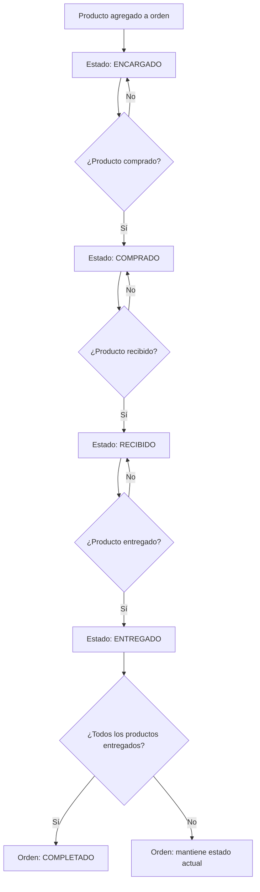
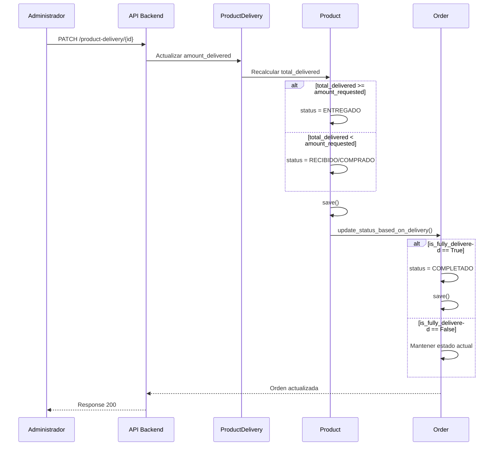

# Sistema de Sincronización de Estados: Órdenes y Productos

**Fecha:** 10 de noviembre de 2025  
**Módulo:** Sistema de Gestión de Órdenes y Productos  
**Backend:** `backend/api/models.py`, `backend/api/views.py`

---

## 📋 Resumen Ejecutivo

El sistema **SÍ actualiza automáticamente** el estado de las órdenes basándose en el estado de entrega de sus productos. Este proceso está implementado en el backend y se ejecuta automáticamente cuando se entregan productos.

---

## 🔄 Flujo de Actualización de Estados

### **Orden → Productos → Orden**



---

## 📊 Estados de Producto

### Definición (ProductStatusEnum)

| Estado | Valor | Descripción |
|--------|-------|-------------|
| **ENCARGADO** | `'Encargado'` | Producto solicitado pero no comprado |
| **COMPRADO** | `'Comprado'` | Producto adquirido pero no recibido |
| **RECIBIDO** | `'Recibido'` | Producto en almacén, listo para entregar |
| **ENTREGADO** | `'Entregado'` | Producto entregado al cliente |

### Transiciones de Estado

#### 1. **ENCARGADO → COMPRADO**
```python
# Cuando se registra una compra (ProductBuyed)
if total_purchased >= product.amount_requested:
    product.status = ProductStatusEnum.COMPRADO.value
```

#### 2. **COMPRADO → RECIBIDO**
```python
# Cuando se registra una recepción (ProductReceived)
if total_received >= product.amount_requested:
    if product.status in [ProductStatusEnum.COMPRADO.value, ProductStatusEnum.ENCARGADO.value]:
        product.status = ProductStatusEnum.RECIBIDO.value
```

#### 3. **RECIBIDO → ENTREGADO**
```python
# Cuando se registra una entrega (ProductDelivery)
if total_delivered >= product.amount_requested:
    if product.status in [ProductStatusEnum.RECIBIDO.value, ProductStatusEnum.COMPRADO.value, ProductStatusEnum.ENCARGADO.value]:
        product.status = ProductStatusEnum.ENTREGADO.value
```

---

## 📊 Estados de Orden

### Definición (OrderStatusEnum)

| Estado | Valor | Descripción |
|--------|-------|-------------|
| **ENCARGADO** | `'Encargado'` | Orden creada, productos pendientes |
| **PROCESANDO** | `'Procesando'` | Orden en proceso de compra/entrega |
| **COMPLETADO** | `'Completado'` | Todos los productos entregados |
| **CANCELADO** | `'Cancelado'` | Orden cancelada |

---

## 🎯 Lógica de Actualización Automática

### **Método: `update_status_based_on_delivery()`**

Ubicación: `backend/api/models.py` - Clase `Order` (línea 165)

```python
def update_status_based_on_delivery(self):
    """
    Actualiza el estado de la orden a COMPLETADO solo cuando todos los productos 
    hayan sido completamente entregados (amount_delivered == amount_purchased para todos)
    """
    if self.status == OrderStatusEnum.CANCELADO.value:
        return  # No cambiar órdenes canceladas
        
    if self.is_fully_delivered:
        # Todos los productos están entregados, marcar como completado
        if self.status != OrderStatusEnum.COMPLETADO.value:
            self.status = OrderStatusEnum.COMPLETADO.value
            self.save(update_fields=['status', 'updated_at'])
```

### **Propiedad: `is_fully_delivered`**

```python
@property
def is_fully_delivered(self):
    """Verifica si todos los productos de la orden han sido completamente entregados"""
    # Solo si hay productos comprados y todos están entregados
    if self.total_products_purchased == 0:
        return False
    return not self.has_pending_delivery
```

### **Propiedad: `has_pending_delivery`**

```python
@property
def has_pending_delivery(self):
    """Verifica si la orden tiene productos pendientes de entregar"""
    for product in self.products.all():
        if product.pending_delivery > 0:
            return True
    return False
```

---

## 🔧 Implementación Técnica

### 1. **Actualización al Entregar Productos**

Ubicación: `backend/api/views.py` - `ProductDeliveryViewSet.update()` (línea 1061)

```python
# Después de actualizar ProductDelivery
if product_delivery.original_product:
    product = product_delivery.original_product
    
    # Recalcular total entregado
    total_delivered = sum(
        pd.amount_delivered 
        for pd in product.delivers.all()
    )
    product.amount_delivered = total_delivered
    
    # Actualizar estado del producto si es necesario
    if total_delivered >= product.amount_requested:
        if product.status in [ProductStatusEnum.RECIBIDO.value, ...]:
            product.status = ProductStatusEnum.ENTREGADO.value
            product.save(update_fields=['amount_delivered', 'status', 'updated_at'])
    
    # ⭐ ACTUALIZAR ESTADO DE LA ORDEN
    if product.order:
        product.order.update_status_based_on_delivery()
```

### 2. **Actualización al Recibir Productos**

Ubicación: `backend/api/views.py` - `ProductReceivedViewSet.update()` (línea 910)

```python
# Después de actualizar ProductReceived
if product_received.original_product:
    product = product_received.original_product
    total_received = sum(
        pr.amount_received 
        for pr in product.receiveds.all()
    )
    product.amount_received = total_received
    
    # Actualizar estado si es necesario
    if total_received >= product.amount_requested:
        if product.status in [ProductStatusEnum.COMPRADO.value, ProductStatusEnum.ENCARGADO.value]:
            product.status = ProductStatusEnum.RECIBIDO.value
            product.save(update_fields=['amount_received', 'status', 'updated_at'])
```

---

## 📈 Propiedades Computadas

### Producto

```python
@property
def pending_purchase(self):
    """Cantidad pendiente de comprar"""
    return self.amount_requested - self.amount_purchased

@property
def pending_delivery(self):
    """Cantidad pendiente de entregar"""
    return self.amount_purchased - self.amount_delivered

@property
def is_fully_purchased(self):
    """Verifica si se ha comprado toda la cantidad solicitada"""
    return self.amount_purchased >= self.amount_requested

@property
def is_fully_delivered(self):
    """Verifica si se ha entregado toda la cantidad comprada"""
    return self.amount_delivered >= self.amount_purchased
```

### Orden

```python
@property
def total_products_requested(self):
    """Total de productos solicitados en la orden"""
    return sum(product.amount_requested for product in self.products.all())

@property
def total_products_purchased(self):
    """Total de productos comprados en la orden"""
    return sum(product.amount_purchased for product in self.products.all())

@property
def total_products_delivered(self):
    """Total de productos entregados en la orden"""
    return sum(product.amount_delivered for product in self.products.all())
```

---

## 🎬 Casos de Uso

### Caso 1: Orden con Múltiples Productos

```
Orden #123
├── Producto A: 10 solicitados
│   ├── 10 comprados
│   ├── 10 recibidos
│   └── 10 entregados ✅ [ENTREGADO]
│
├── Producto B: 5 solicitados
│   ├── 5 comprados
│   ├── 5 recibidos
│   └── 3 entregados ⏳ [RECIBIDO]
│
└── Estado de Orden: PROCESANDO (no todos entregados)
```

**Resultado:** La orden se mantiene en estado actual porque el Producto B aún tiene 2 unidades pendientes de entregar.

### Caso 2: Orden Completamente Entregada

```
Orden #124
├── Producto A: 10 solicitados
│   ├── 10 comprados
│   ├── 10 recibidos
│   └── 10 entregados ✅ [ENTREGADO]
│
├── Producto B: 5 solicitados
│   ├── 5 comprados
│   ├── 5 recibidos
│   └── 5 entregados ✅ [ENTREGADO]
│
└── Estado de Orden: COMPLETADO ✅ (automático)
```

**Resultado:** La orden cambia automáticamente a COMPLETADO porque todos los productos están completamente entregados.

### Caso 3: Orden con Entrega Parcial

```
Orden #125
├── Producto A: 10 solicitados
│   ├── 8 comprados (2 pendientes)
│   ├── 8 recibidos
│   └── 5 entregados [RECIBIDO]
│
└── Estado de Orden: PROCESANDO (no todo comprado ni entregado)
```

**Resultado:** La orden no cambia a COMPLETADO porque:
1. No se han comprado todas las unidades solicitadas
2. No se han entregado todas las unidades compradas

---

## 🔐 Reglas de Negocio

### Para Productos

1. **Estado ENTREGADO**: Se alcanza cuando `amount_delivered >= amount_requested`
2. **Estado RECIBIDO**: Se alcanza cuando `amount_received >= amount_requested`
3. **Estado COMPRADO**: Se alcanza cuando `amount_purchased >= amount_requested`
4. **Transiciones reversibles**: Si se elimina una entrega, el estado puede retroceder

### Para Órdenes

1. **Estado COMPLETADO**: Solo cuando `is_fully_delivered == True`
2. **Condición necesaria**: `amount_delivered == amount_purchased` para TODOS los productos
3. **Excepción**: Órdenes CANCELADAS nunca cambian a COMPLETADO
4. **Automático**: Se ejecuta después de cada actualización de entrega

---

## ⚡ Ventajas del Sistema Actual

1. ✅ **Automatización total**: No requiere intervención manual
2. ✅ **Consistencia**: El estado siempre refleja la realidad
3. ✅ **Transaccional**: Usa `transaction.atomic()` para evitar inconsistencias
4. ✅ **Trazabilidad**: Cada cambio se registra con timestamp
5. ✅ **Reversible**: Permite corregir errores en las entregas

---

## 🚨 Consideraciones Importantes

### ⚠️ Órdenes Canceladas

```python
if self.status == OrderStatusEnum.CANCELADO.value:
    return  # No cambiar órdenes canceladas
```

Las órdenes canceladas **NO** cambian automáticamente a COMPLETADO, incluso si todos los productos se entregan.

### ⚠️ Productos Comprados vs Solicitados

```python
if self.total_products_purchased == 0:
    return False
```

Una orden **NO** puede estar completada si no se ha comprado ningún producto, incluso si no tiene productos pendientes.

### ⚠️ Sincronización Frontend

El frontend debe:
1. Refrescar la orden después de actualizar entregas
2. Invalidar queries de TanStack Query relacionadas
3. Mostrar el estado actualizado en tiempo real

---

## 📊 Diagrama de Flujo Completo



---

## 🧪 Pruebas Recomendadas

### Test 1: Orden Simple
```python
def test_order_completes_when_all_products_delivered():
    order = Order.objects.create(...)
    product = Product.objects.create(order=order, amount_requested=10)
    
    # Comprar
    ProductBuyed.objects.create(product=product, amount_buyed=10)
    # Recibir
    ProductReceived.objects.create(product=product, amount_received=10)
    # Entregar
    ProductDelivery.objects.create(product=product, amount_delivered=10)
    
    order.refresh_from_db()
    assert order.status == OrderStatusEnum.COMPLETADO.value
```

### Test 2: Orden con Entrega Parcial
```python
def test_order_stays_processing_with_partial_delivery():
    order = Order.objects.create(...)
    product = Product.objects.create(order=order, amount_requested=10)
    
    ProductBuyed.objects.create(product=product, amount_buyed=10)
    ProductReceived.objects.create(product=product, amount_received=10)
    ProductDelivery.objects.create(product=product, amount_delivered=5)
    
    order.refresh_from_db()
    assert order.status != OrderStatusEnum.COMPLETADO.value
```

---

## 🔧 Mejoras Futuras Sugeridas

1. **Notificaciones en tiempo real**
   - Enviar notificación al cliente cuando su orden cambie a COMPLETADO
   - Alertar al agente sobre entregas pendientes

2. **Dashboard de estados**
   - Visualización gráfica del progreso de entregas
   - Métricas de tiempo promedio hasta COMPLETADO

3. **Auditoría de cambios**
   - Registrar historial de cambios de estado
   - Identificar quién y cuándo se realizó cada cambio

4. **Validaciones adicionales**
   - Prevenir entregas sin recepción previa
   - Validar cantidades lógicas

5. **Estados intermedios**
   - Considerar estado "EN_TRANSITO" para productos enviados pero no recibidos
   - Estado "PARCIALMENTE_ENTREGADO" para órdenes con entregas parciales

---

## 📚 Referencias

- **Modelos**: `backend/api/models.py`
  - Clase `Order` (línea 129)
  - Clase `Product` (línea 380)
  
- **Vistas**: `backend/api/views.py`
  - `ProductDeliveryViewSet.update()` (línea 1025)
  - `ProductReceivedViewSet.update()` (línea 900)

- **Enumeraciones**: `backend/api/enums.py`
  - `OrderStatusEnum`
  - `ProductStatusEnum`

- **Signals**: `backend/api/signals_notifications.py`
  - Notificaciones de cambio de estado

---

## ✅ Conclusión

El sistema **funciona correctamente** y actualiza automáticamente el estado de las órdenes basándose en el estado de entrega de sus productos. La implementación es:

- ✅ Robusta
- ✅ Automática
- ✅ Transaccional
- ✅ Reversible
- ✅ Bien documentada

**No se requieren cambios en el frontend** para esta funcionalidad, ya que el backend maneja toda la lógica de sincronización de estados.

---

**Estado**: ✅ Verificado y Documentado  
**Autor**: Sistema de IA  
**Revisión**: Pendiente
