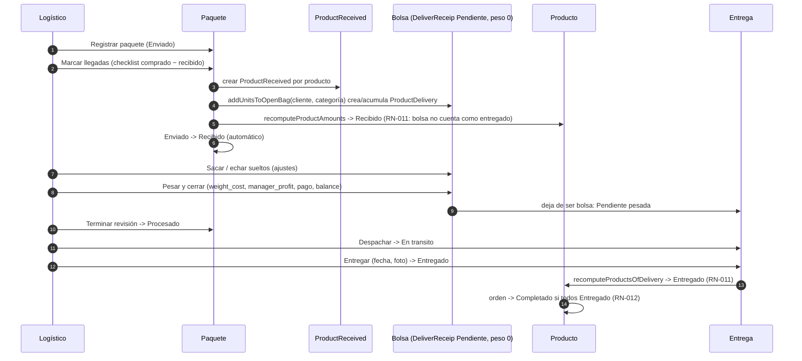

# Ciclo de vida end-to-end

Del encargo del cliente al cobro final. Este documento describe el **flujo objetivo** aprobado (ADR-0001 a ADR-0006). Donde la implementación actual difiere, se indica en [`conformidad.md`](conformidad.md).

## Vista general

## Pasos, responsables y artefactos

| # | Paso | Responsable | Pantalla en admin-next | Artefactos creados o modificados | Estados que cambian |
|---|---|---|---|---|---|
| 1 | El cliente pide productos a su agente (WhatsApp, lista compartida desde la app cliente). | Cliente | `apps/client` (lista local, sin escritura en BD) | Ninguno en BD. | — |
| 2 | El agente crea la **orden** y añade los **productos** con tienda, cantidad, precio, envío, IVA, tarifa y **categoría obligatoria**. El costo se calcula con RN-001 y `total_costs` de la orden se refresca. | Agente (o admin) | `/orders`, `/orders/[id]` | `Order` (`Encargado`, `No pagado`), `Product` × n (`Encargado`). | ES-orden: nace `Encargado`. ES-producto: `Encargado`. |
| 3 | El admin crea la **compra** eligiendo tienda y cuenta de compra y marcando, en un checklist agrupado por cliente, qué productos pendientes compra y cuántas unidades (tope: pedidas − compradas). Todo en una transacción. | Admin | `/purchases/new` (entrada opcional desde `/orders/[id]` con "Comprar pendientes") | `ShoppingReceip`, `ProductBuyed` × n; `Product.amount_purchased` recalculado. | ES-producto: `Encargado → Comprado` si se compró todo lo pedido (RN-010). ES-orden: `Encargado → Procesando` (RN-012). |
| 4 | Reembolsos: si la tienda devuelve unidades, se registra `quantity_refuned` en el producto comprado. | Admin | `/purchases/[id]` | `ProductBuyed.quantity_refuned`; `amount_purchased` baja. | ES-producto puede volver a `Encargado`. |
| 5 | El logístico registra el **paquete** que llega (agencia, número de seguimiento). | Logístico | `/packages` | `Package` (`Enviado`). | ES-paquete: nace `Enviado`. |
| 6 | El logístico marca las **llegadas**: en el checklist del paquete (o en `/delivery/prepare`) indica qué productos esperados (comprados − recibidos) venían y cuántas unidades. Cada unidad recibida cae automáticamente en la **bolsa** abierta de su cliente y categoría (se crea si no existe). Todo en una transacción. | Logístico | `/packages/[id]` o `/delivery/prepare` (fase 1) | `ProductReceived` × n; `DeliverReceip` bolsa (`Pendiente`, peso 0) si no existía; `ProductDelivery` × n dentro de la bolsa; `Product.amount_received` y `amount_delivered` recalculados. | ES-paquete: `Enviado → Recibido` automático con la primera llegada. ES-producto: `Comprado → Recibido` (RN-010); **no** pasa a `Entregado` aunque esté en bolsa (RN-011). |
| 7 | El logístico revisa la bolsa: saca unidades que no van (vuelven a "recibido sin bolsa"), echa sueltos recibidos antes, y **pesa**. Pesar fija `weight`, calcula `weight_cost` (RN-002) y `manager_profit` (RN-003), deriva el estado de pago (RN-020), recalcula el balance (RN-021) y **cierra** la bolsa. Cuando termina con el paquete, "Terminar revisión". | Logístico | `/delivery/prepare` (fase 2), `/packages/[id]` | `DeliverReceip.weight`, `weight_cost`, `manager_profit`, `payment_status`; `CustomUser.balance`. `Package.status`. | ES-entrega: `Pendiente (bolsa) → Pendiente (pesada)`. ES-paquete: `Recibido → Procesado`. |
| 8 | Alternativa al paso 6-7 para unidades recibidas que no cayeron en bolsa (importaciones antiguas, unidades sacadas): "Armar entrega desde recibidos" elige cliente, marca unidades por categoría y opcionalmente pesa en el mismo acto. | Logístico | `/delivery` → "Armar entrega desde recibidos" | `DeliverReceip` + `ProductDelivery`. | Igual que 6-7. |
| 9 | **Despachar**: la entrega pesada sale hacia el cliente. | Logístico | `/delivery`, `/delivery/[id]` (botón "Despachar") | `DeliverReceip.status`. | ES-entrega: `Pendiente → En transito` (exige peso > 0). |
| 10 | **Entregar**: se confirma la entrega con fecha y foto. Se recalculan todos los productos de la entrega. Si no se pudo entregar, "Marcar fallida" y después "Reintentar". | Logístico | `/delivery/[id]` (botón "Entregar" / "Fallida") | `DeliverReceip.status`, `deliver_date`, `deliver_picture`; `Product.status` de cada producto. | ES-entrega: `En transito → Entregado` o `→ Fallida`. ES-producto: `Recibido → Entregado` cuando todas sus unidades están en entregas `Entregado` (RN-011). ES-orden: `Procesando → Completado` cuando todos sus productos están `Entregado` (RN-012). |
| 11 | **Cobrar**: el contador registra el efectivo recibido por la orden (costo de los productos) y por la entrega (costo por peso), y aplica saldo a favor si lo hay. Los cobros son acumulativos. | Contador (o admin) | `/orders/[id]` y `/delivery/[id]` (panel de pago) | `Order.received_value_of_client`, `balance_applied`, `pay_status`; `DeliverReceip.payment_amount`, `balance_applied`, `payment_status`; `CustomUser.balance`. | ES-pago: `No pagado → Parcial → Pagado` (RN-020). Balance (RN-021, RN-022). |
| 12 | El cliente sigue el estado de sus órdenes y entregas. | Cliente | `apps/client` (Orders, Deliveries) | Ninguno. | — |

## Secuencia detallada de recepción y entrega

## Qué cambia respecto al flujo anterior

| Antes (admin-next hasta 1.0.0) | Objetivo |
|---|---|
| Compra "uno a uno": se creaba la cabecera y se añadían productos de uno en uno. | Compra desde un checklist de productos pendientes de la tienda, agrupado por cliente, en una transacción (ADR-0002). |
| Recepción en dos sitios con listas distintas (`/packages/[id]` uno a uno, `/delivery/prepare` con lista plana y tope de 80 visibles). | Un solo componente de checklist de llegadas, con filtros por tienda/compra/cliente y acción "Asignar categoría" en línea (ADR-0003). |
| Estado del paquete en un select libre. | Máquina de estados: `Enviado → Recibido` automático, `Recibido → Procesado` con "Terminar revisión", `Procesado → Recibido` solo admin. |
| "Nueva entrega" manual convivía con las bolsas automáticas. | Un solo camino: bolsa → pesar → despachar → entregar. "Armar entrega desde recibidos" reutiliza la bolsa (ADR-0004). |
| Estado de entrega en un select libre; re-pesar posible. | Acciones explícitas por transición; re-pesar y reabrir solo admin (ES-entrega, INV-004). |
| El producto pasaba a `Entregado` en cuanto caía en la bolsa. | `Entregado` solo cuando su entrega está `Entregado`; mientras tanto `Recibido` con indicador "en bolsa/entrega" (RN-011, ADR-0005). |
| Bolsas contadas como "entregas pendientes" en dashboards y `/delivery`. | Bolsas etiquetadas "En preparación" y fuera de los contadores de pendientes. |
| Estado de orden manual. | Derivado según RN-012 en cada recálculo de producto (pendiente de implementar en admin-next; ver conformidad). |
