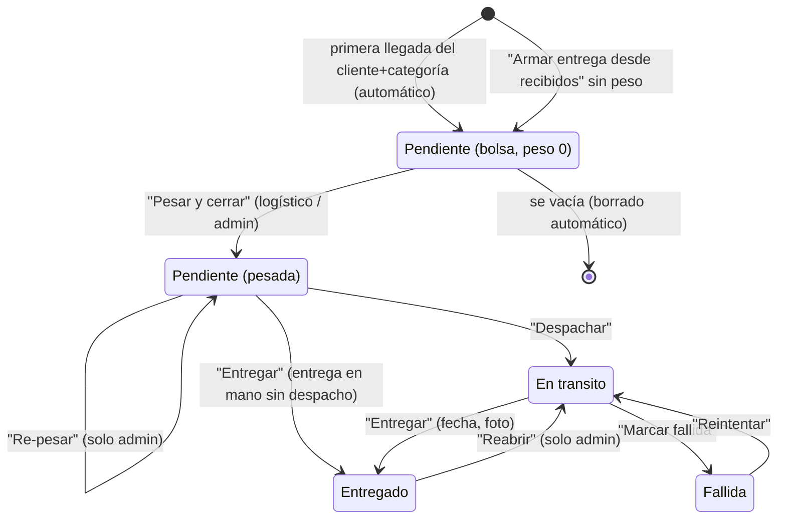

# ES-entrega — Estados de la entrega (incluida la bolsa)

Entidad: `DeliverReceip` (`backend/api/models/deliveries.py`, Prisma `DeliverReceip`). Valores canónicos en `backend/api/enums.py` (`DeliveryStatusEnum`): `Pendiente`, `En transito` (sin tilde en el valor; la etiqueta es "En tránsito"), `Entregado`, `Fallida`. Máquina de estados nueva en 1.0.0 (ADR-0004): sustituye al select libre por acciones explícitas (`src/lib/delivery-status.ts`, fase 3 del plan). El estado de pago es una máquina aparte: [`pago.md`](pago.md).

La entrega tiene **dos fases dentro de `Pendiente`** que se distinguen por el peso:

| Subestado | Condición | Nombre en la interfaz |
|---|---|---|
| Bolsa | `status = Pendiente` y `weight = 0` (INV-003) | "En preparación" |
| Pesada | `status = Pendiente` y `weight > 0` | "Pendiente" |

## Estados

| Estado | Significado |
|---|---|
| `Pendiente` (bolsa) | Agrupa unidades recibidas de un cliente y categoría; sin peso ni costo; se ajusta libremente. |
| `Pendiente` (pesada) | Peso registrado, `weight_cost` y `manager_profit` fijados; lista para despachar; ya es cobrable. |
| `En transito` | Salió hacia el cliente. |
| `Entregado` | Entregada al cliente, con fecha y foto. Las unidades cuentan para el estado del producto (RN-011). |
| `Fallida` | Intento de entrega fallido; se puede reintentar. |

## Diagrama

## Transiciones

| Desde | Hacia | Quién | Precondición | Efecto |
|---|---|---|---|---|
| — | `Pendiente` (bolsa) | automático (`addUnitsToOpenBag`) | Llega una unidad de un cliente y categoría sin bolsa abierta; producto con categoría (INV-002). | Se crea `DeliverReceip` con peso 0, sin pagos, `deliver_date = ahora`. |
| — | `Pendiente` (bolsa) | logístico, admin | "Armar entrega desde recibidos" con unidades `amountReceived − amountDelivered > 0` del cliente. | Igual que la anterior, más `ProductDelivery` por unidad marcada. |
| `Pendiente` (bolsa) | `Pendiente` (bolsa) | logístico, admin | Sacar unidades (`adjustBagItemAction`) o echar sueltos (`addLooseToBagAction`); INV-001 e INV-005. | `ProductDelivery` ajustado; producto recalculado (sigue `Recibido`, RN-011). |
| `Pendiente` (bolsa) | (borrada) | automático | La bolsa queda sin `ProductDelivery`. | `deleteBagIfEmpty`. |
| `Pendiente` (bolsa) | `Pendiente` (pesada) | logístico, admin | `weight > 0`; `weight` actual = 0 (INV-004); la bolsa tiene al menos una unidad. | `weight`, `weight_cost` (RN-002), `manager_profit` (RN-003), `payment_status` (RN-020), balance del cliente (RN-021). La bolsa se cierra: nuevas llegadas abren otra. |
| `Pendiente` (pesada) | `Pendiente` (pesada) | admin | Acción "Re-pesar" con `force`. | Recalcula los mismos campos que pesar. Queda registrado. |
| `Pendiente` (pesada) | `En transito` | logístico, admin | `weight > 0`. | Ninguno adicional. |
| `Pendiente` (pesada) | `Entregado` | logístico, admin | `weight > 0`. Caso de entrega en mano en el almacén. | Igual que `En transito → Entregado`. |
| `En transito` | `Entregado` | logístico, admin | — | `deliver_date` = fecha indicada o ahora; `deliver_picture` opcional; se recalculan **todos** los productos de la entrega (RN-011) y sus órdenes (RN-012). |
| `En transito` | `Fallida` | logístico, admin | — | Ninguno sobre productos. |
| `Fallida` | `En transito` | logístico, admin | — | Ninguno. |
| `Entregado` | `En transito` | admin | Acción "Reabrir". | Se recalculan todos los productos: vuelven a `Recibido`; órdenes vuelven a `Procesando`. Los cobros no se tocan. |

Transiciones **no permitidas**: cualquier salida de la bolsa distinta de pesar o borrar; `Pendiente → Fallida`; `Fallida → Entregado` directo (primero reintentar); `Entregado → Pendiente`; cualquier cambio de estado con `weight = 0`. `updateDeliveryAction` no acepta `status` ni `weight` cuando la entrega ya está pesada (INV-006, INV-004).

## Añadir y quitar productos después de pesar

- Añadir unidades a una entrega pesada está permitido para logístico y admin mientras no esté `Entregado` (INV-001, INV-005). El peso y el costo no se recalculan automáticamente; si cambia el peso real, el admin re-pesa.
- Quitar unidades está permitido mientras no esté `Entregado`. Si la entrega queda vacía y tiene peso o pagos, no se borra: el admin decide.
- Con la entrega `Entregado`, añadir o quitar unidades está bloqueado; hay que reabrir.

## Borrado

- Bolsa (peso 0, sin pagos): se vacía (`productDelivery.deleteMany`) y se borra en una transacción; los productos se recalculan y vuelven a "recibido sin bolsa".
- Entrega con peso o pagos: no se borra; mensaje claro. Un admin puede reabrirla, vaciarla y entonces sí borrarla.

## Regla de derivación

No aplica al estado de la entrega. Sí a las fechas: `deliver_date` se fija al pasar a `Entregado` (hasta la fase 3, admin-next la sella al crear la bolsa, bug N10).
