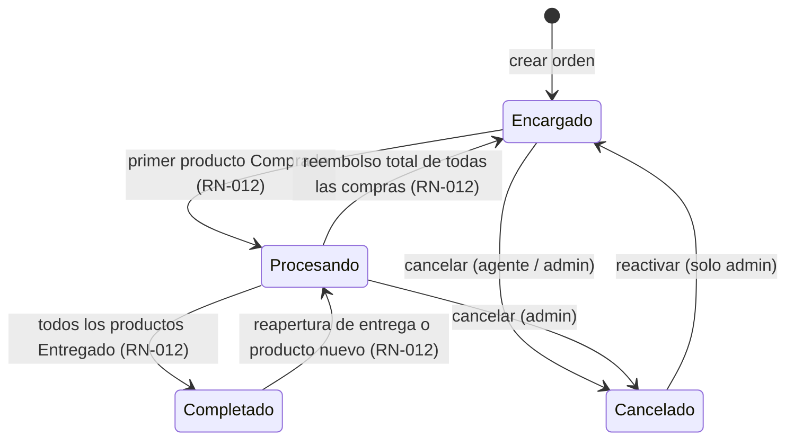

# ES-orden — Estados de la orden

Entidad: `Order` (`backend/api/models/orders.py`, Prisma `Order`). Valores canónicos en `backend/api/enums.py` (`OrderStatusEnum`). El estado de pago de la orden es una máquina aparte: [`pago.md`](pago.md).

## Estados

| Estado | Significado | Derivado |
|---|---|---|
| `Encargado` | La orden existe y ningún producto ha sido comprado por completo. | Sí (RN-012) |
| `Procesando` | Al menos un producto está `Comprado`, `Recibido` o `Entregado`. | Sí (RN-012) |
| `Completado` | Todos los productos están `Entregado`. | Sí (RN-012) |
| `Cancelado` | El agente o el admin cancelaron la orden. Estado terminal salvo reactivación por admin. | No (manual) |

## Diagrama

## Transiciones

| Desde | Hacia | Quién | Precondición | Efecto |
|---|---|---|---|---|
| — | `Encargado` | agente (propios), admin | Cliente con agente asignado. | Se crea `Order` con `pay_status = No pagado`, `total_costs = 0`. |
| `Encargado` | `Procesando` | automático | Algún producto cumple RN-010 con estado `Comprado` o superior. | Ninguno adicional. |
| `Procesando` | `Completado` | automático | Todos los productos están `Entregado` (con RN-011: todas sus unidades en entregas `Entregado`). | Ninguno adicional; la orden sigue cobrable. |
| `Completado` | `Procesando` | automático | Un admin reabre una entrega, o se añade un producto nuevo a la orden. | Ninguno adicional. |
| `Procesando` | `Encargado` | automático | Todos los productos vuelven a `Encargado` (reembolsos). | Ninguno adicional. |
| `Encargado` / `Procesando` | `Cancelado` | agente (solo si `Encargado` y propia), admin | Ningún producto con recepciones ni entregas (si las hay, primero se retiran). | La derivación RN-012 deja de aplicarse. No cambia costos ni pagos: si la orden tiene cobros, el contador debe devolverlos o dejarlos como saldo a favor (RN-021 los sigue contando). |
| `Cancelado` | `Encargado` | admin | — | Se vuelve a aplicar RN-012 en el siguiente recálculo. |

## Regla de derivación

RN-012 en [`../reglas/estados.md`](../reglas/estados.md). Se ejecuta tras cada recálculo de estado de cualquier producto de la orden y tras borrar un producto. **Hoy admin-next no la deriva** (el estado solo cambia en el formulario de la orden); Django sí. Hasta que se implemente en admin-next (plan de rediseño), el estado de una orden creada o modificada desde admin-next puede quedar desactualizado.

## Efectos colaterales relacionados

- Añadir, editar o borrar un producto refresca `total_costs` (RN-001) y el estado de pago (RN-020).
- Borrar la orden exige que sus productos no tengan compras, recepciones ni entregas; borra los productos en la misma transacción y recalcula el balance del cliente (RN-021).
