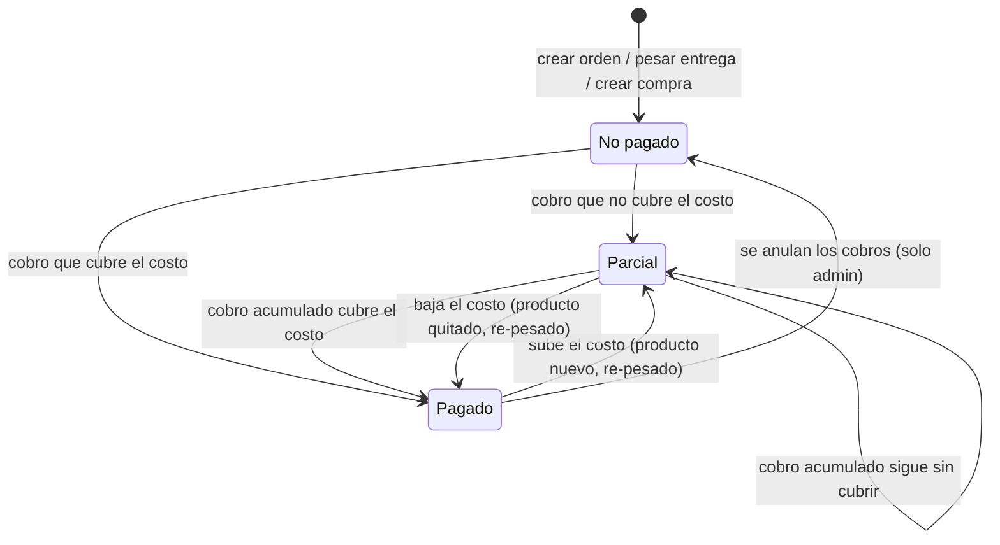

# ES-pago — Estado de pago

Aplica a tres entidades con el mismo conjunto de valores (`backend/api/enums.py`, `PaymentStatusEnum`): `Order.pay_status`, `DeliverReceip.payment_status` y `ShoppingReceip.status_of_shopping`. Valores canónicos: `No pagado`, `Parcial`, `Pagado`. El valor `Pendiente` que envía `ConfirmPaymentDialog` del admin Vite no existe (contradicción C13 / bug de Vite); las etiquetas "No Pagado" y "Pago Parcial" son solo presentación.

## Estados

| Estado | Significado |
|---|---|
| `No pagado` | No se ha registrado efectivo ni saldo aplicado. |
| `Parcial` | Hay dinero registrado pero no cubre el costo, o el costo es 0 y aun así hay dinero. |
| `Pagado` | Efectivo + saldo aplicado ≥ costo y costo > 0. |

## Diagrama



## Transiciones

| Desde | Hacia | Quién | Precondición | Efecto |
|---|---|---|---|---|
| — | `No pagado` | automático | Se crea la orden, la compra o la entrega (la bolsa nace con costo 0). | — |
| cualquiera | derivado (RN-020) | contador, admin al registrar cobro | Orden: `total_costs > 0`. Entrega: `weight > 0` (una bolsa no se cobra, INV-003). Importe > 0 o saldo aplicado > 0 (RN-022). | Efectivo y saldo aplicado se **suman**; se recalcula el estado (RN-020) y el balance del cliente (RN-021) en una transacción. |
| cualquiera | derivado (RN-020) | automático al cambiar el costo | Añadir/editar/quitar producto de la orden; re-pesar la entrega (admin). | Solo cambia el estado; los importes registrados no se tocan. |
| cualquiera | `No pagado` | admin | Anulación explícita de cobros (poner efectivo y saldo aplicado a 0). | Recalcula balance. No existe hoy como acción en admin-next; se hace desde Django admin. |
| compra: cualquiera | cualquiera | admin | La compra no deriva su estado: el admin lo fija al crearla o editarla según lo pagado con la tarjeta. | — |

## Regla de derivación

RN-020 en [`../reglas/pagos.md`](../reglas/pagos.md):

```
Pagado     si round2(efectivo + saldoAplicado) ≥ round2(costo) y costo > 0
Parcial    si round2(efectivo + saldoAplicado) > 0
No pagado  en otro caso
```

Se aplica en orden y entrega; en la compra el estado es manual.

## Relación con el balance

El estado de pago responde "¿está cubierta esta orden/entrega?"; el balance (RN-021) responde "¿cuánto debe o tiene a favor el cliente en total?". Son independientes: una orden `Pagado` con sobrepago genera saldo a favor; una orden `Parcial` cubierta después con saldo aplicado pasa a `Pagado` sin mover el balance (RN-022).
