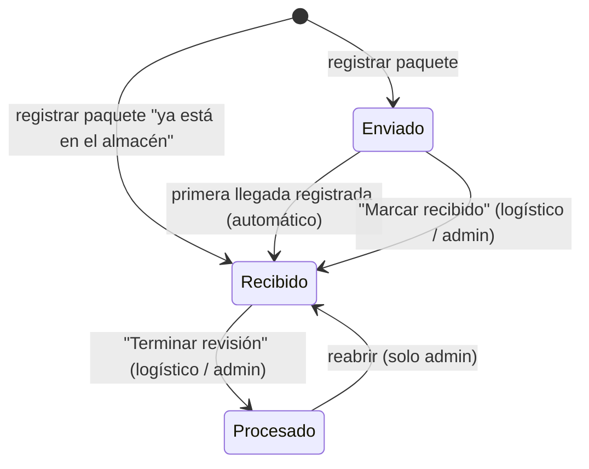

# ES-paquete — Estados del paquete

Entidad: `Package` (`backend/api/models/deliveries.py`, Prisma `Package`). Valores canónicos en `backend/api/enums.py` (`PackageStatusEnum`). Máquina de estados nueva en 1.0.0 (ADR-0003): sustituye al select libre de `package-dialog.tsx` y `packages-client.tsx` por transiciones con rol (`src/lib/package-status.ts`, fase 2 del plan).

## Estados

| Estado | Significado |
|---|---|
| `Enviado` | El paquete viene de camino (registrado con número de seguimiento y agencia); no se ha marcado ninguna llegada. |
| `Recibido` | El paquete está en el almacén y se están marcando llegadas; puede tener recepciones registradas. |
| `Procesado` | Revisión terminada: todas las llegadas del paquete están registradas y embolsadas. Estado terminal salvo reapertura por admin. |

## Diagrama

## Transiciones

| Desde | Hacia | Quién | Precondición | Efecto |
|---|---|---|---|---|
| — | `Enviado` | logístico, admin | Número de seguimiento y agencia. | Se crea `Package`. |
| — | `Recibido` | logístico, admin | Se marca "Ya está en el almacén" y la fecha de llegada es ≤ hoy. | Se crea `Package` directamente en `Recibido`. |
| `Enviado` | `Recibido` | automático | Se registra la primera `ProductReceived` del paquete (`registerArrivalsAction`). | Ninguno adicional; ocurre dentro de la misma transacción que las recepciones y las bolsas. |
| `Enviado` | `Recibido` | logístico, admin | Acción explícita "Marcar recibido" aunque aún no se marquen llegadas. | Ninguno. |
| `Recibido` | `Procesado` | logístico, admin | Acción "Terminar revisión". No exige que todo lo esperado haya llegado: lo que falte sigue como pendiente de recibir en otros paquetes. | El paquete deja de aparecer en la fase 1 de `/delivery/prepare`. |
| `Procesado` | `Recibido` | admin | Acción "Reabrir revisión". | Vuelve a aparecer en preparación; se pueden añadir o quitar llegadas. |

Transiciones **no permitidas**: `Recibido → Enviado`, `Procesado → Enviado`, `Enviado → Procesado`. `updatePackageAction` no acepta el campo `status` (INV-006).

## Efectos sobre otras entidades

- Registrar llegadas crea `ProductReceived` y, por INV-002, exige categoría; cada unidad entra en la bolsa del cliente y categoría (ES-entrega) y recalcula el producto (RN-010/RN-011).
- Quitar una llegada retira primero las unidades de bolsas abiertas; si están en una entrega pesada, se bloquea (INV-001).
- Borrar un paquete solo es posible sin recepciones (o borrándolas antes con las reglas anteriores).

## Regla de derivación

No aplica: el estado del paquete no se deriva de cantidades; solo cambia por las transiciones de la tabla. La única transición automática es `Enviado → Recibido` con la primera llegada.
