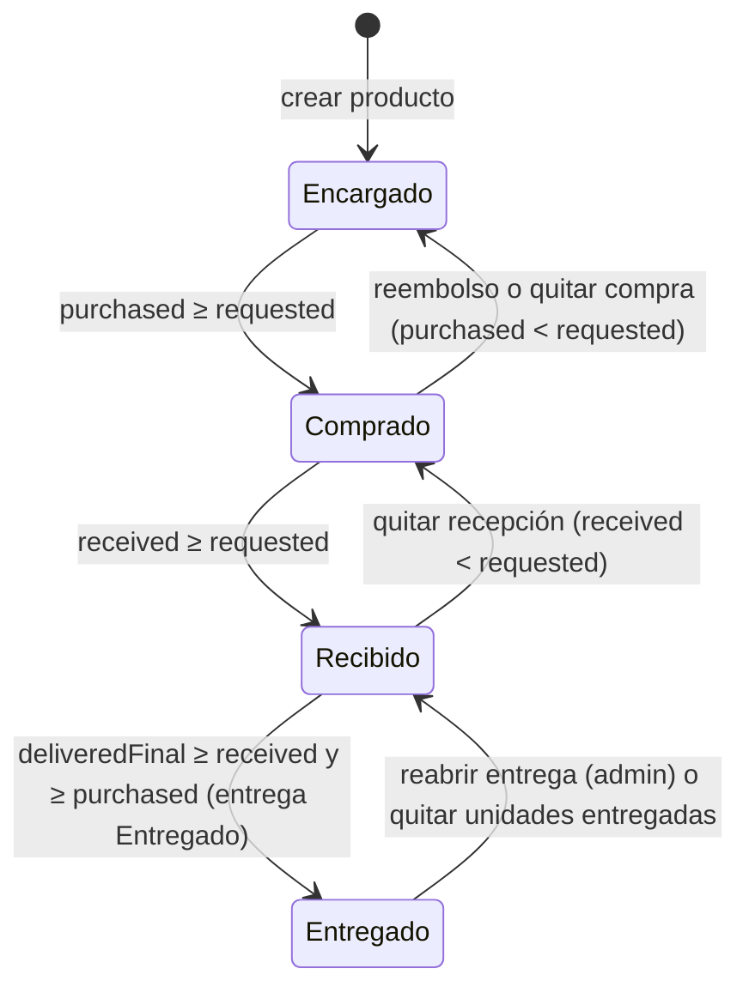

# ES-producto — Estados del producto

Entidad: `Product` (`backend/api/models/products.py`, Prisma `Product`). Valores canónicos en `backend/api/enums.py` (`ProductStatusEnum`). El producto **no tiene** estado `Cancelado` ni `Procesando`: los tipos de `apps/client` y algunas constantes de `apps/admin` que los declaran están mal (contradicciones C16/C18).

## Estados

| Estado | Significado |
|---|---|
| `Encargado` | Pedido y no comprado por completo (incluye compra parcial y reembolso total). |
| `Comprado` | Comprada toda la cantidad pedida; falta recibir alguna unidad. |
| `Recibido` | Recibida toda la cantidad pedida; falta entregar alguna unidad (incluidas las que están en bolsa o en tránsito, RN-011). |
| `Entregado` | Todas las unidades están en entregas con estado `Entregado`. |

Todos los estados se derivan de cantidades (RN-010) y del estado de las entregas (RN-011). Ningún rol los edita a mano.

## Diagrama



## Transiciones

| Desde | Hacia | Quién dispara | Precondición (tras el recálculo) | Efecto |
|---|---|---|---|---|
| — | `Encargado` | agente / admin crea el producto | Categoría, tienda, cantidad > 0. | `total_costs` de la orden refrescado (RN-001); orden puede pasar a `Encargado`/`Procesando` (RN-012). |
| `Encargado` | `Comprado` | admin al comprar | `amountPurchased ≥ amountRequested` y `amountReceived < amountRequested`. | Orden → `Procesando` (RN-012). |
| `Comprado` | `Encargado` | admin al reembolsar o quitar unidades compradas | `amountPurchased < amountRequested`; INV-001 exige `amountPurchased ≥ amountReceived`. | Orden puede volver a `Encargado`. |
| `Comprado` | `Recibido` | logístico al registrar llegadas | `amountReceived ≥ amountRequested`; las unidades caen en la bolsa pero **no** cuentan como entregadas (RN-011). | Bolsa creada o ampliada. Paquete `Enviado → Recibido`. |
| `Recibido` | `Comprado` | logístico al quitar una recepción | `amountReceived < amountRequested`; solo si las unidades se pueden sacar de bolsas abiertas (INV-001). | Bolsa reducida o borrada si queda vacía. |
| `Recibido` | `Entregado` | logístico al marcar la entrega `Entregado` | `amountDeliveredFinal ≥ amountReceived` y `≥ amountPurchased` y `> 0`. | Orden → `Completado` si todos los productos están `Entregado` (RN-012). |
| `Entregado` | `Recibido` | admin al reabrir una entrega; logístico al quitar unidades de una entrega no entregada | `amountDeliveredFinal < amountReceived`. | Orden → `Procesando`. |

## Regla de derivación

Tabla exacta en RN-010 y ajuste de RN-011 en [`../reglas/estados.md`](../reglas/estados.md). Resumen:

```
del = Σ ProductDelivery.amountDelivered con deliverReceip.status = Entregado   (RN-011)
Entregado  si pur ≥ req y rec ≥ req y del ≥ rec y del ≥ pur y del > 0
Recibido   si pur ≥ req y rec ≥ req y del < rec y rec > 0
Comprado   si pur ≥ req y rec < req y pur > 0
Encargado  en otro caso
```

Se recalcula (`recomputeProductAmounts` en admin-next, `ProductStatusService.recalculate_product_status` + señales en Django) después de cada alta, cambio o baja de `ProductBuyed`, `ProductReceived`, `ProductDelivery`, y después de cada cambio de estado de una `DeliverReceip` (para todos sus productos).

## Indicadores derivados para la interfaz

| Indicador | Cálculo | Uso |
|---|---|---|
| Pendiente de comprar | `amountRequested − amountPurchased` | checklist de compra |
| Pendiente de recibir | `amountPurchased − amountReceived` | checklist de llegadas |
| Recibido sin bolsa | `amountReceived − amountDelivered` | "Armar entrega desde recibidos", echar sueltos |
| En bolsa / en entrega | `amountDelivered − amountDeliveredFinal` | chip junto al estado `Recibido` |
